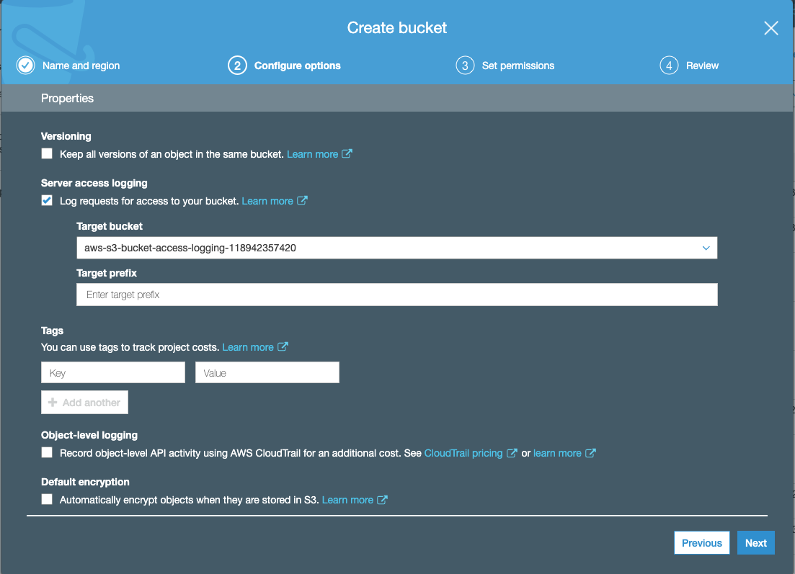
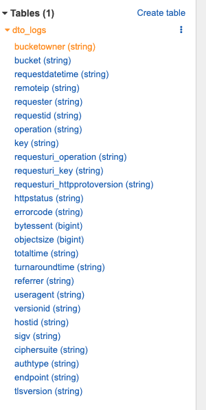

# Monitoring data transfer costs using Athena and S3 Bucket Access Logging

1. Create a source s3 bucket to store source data. Or you can modify an existing bucket. In step 2: Configure options, turn on Server access logging. 

    

2. Set a target bucket to store the access logs. This log bucket should be restricted to audit-level Principals.

3. Perform some tasks to upload/remove data from the source bucket. You should now see new logs in your target bucket. A access log structure looks like this: 

    ```      
      79a59df900b949e55d96a1e698fbacedfd6e09d98eacf8f8d5218e7cd47ef2be awsexamplebucket [06/Feb/2019:00:00:38 +0000] 192.0.2.3 79a59df900b949e55d96a1e698fbacedfd6e09d98eacf8f8d5218e7cd47ef2be 3E57427F3EXAMPLE REST.GET.VERSIONING - "GET /awsexamplebucket?versioning HTTP/1.1" 200 - 113 - 7 - "-" "S3Console/0.4" - 
      
    ```
    
    The fields are listed [here](https://docs.aws.amazon.com/AmazonS3/latest/dev/LogFormat.html).
    
4. Open the Athena console. Configure a result bucket in s3 for Athena if you see this warning.

    

5. Execute the following query to create a database: 

    ```
      create database s3_access_logs_db;
    ```

6. Execute the following query to load your s3 log data into Athena

    ```
      CREATE EXTERNAL TABLE IF NOT EXISTS s3_access_logs_db.dto_logs(
         BucketOwner STRING,
         Bucket STRING,
         RequestDateTime STRING,
         RemoteIP STRING,
         Requester STRING,
         RequestID STRING,
         Operation STRING,
         Key STRING,
         RequestURI_operation STRING,
         RequestURI_key STRING,
         RequestURI_httpProtoversion STRING,
         HTTPstatus STRING,
         ErrorCode STRING,
         BytesSent BIGINT,
         ObjectSize BIGINT,
         TotalTime STRING,
         TurnAroundTime STRING,
         Referrer STRING,
         UserAgent STRING,
         VersionId STRING,
         HostId STRING,
         SigV STRING,
         CipherSuite STRING,
         AuthType STRING,
         EndPoint STRING,
         TLSVersion STRING
      ) 
      ROW FORMAT SERDE 'org.apache.hadoop.hive.serde2.RegexSerDe'
      WITH SERDEPROPERTIES (
               'serialization.format' = '1', 'input.regex' = '([^ ]*) ([^ ]*) \\[(.*?)\\] ([^ ]*) ([^ ]*) ([^ ]*) ([^ ]*) ([^ ]*) \\\"([^ ]*) ([^ ]*) (- |[^ ]*)\\\" (-|[0-9]*) ([^ ]*) ([^ ]*) ([^ ]*) ([^ ]*) ([^ ]*) ([^ ]*) (\"[^\"]*\") ([^ ]*)(?: ([^ ]*) ([^ ]*) ([^ ]*) ([^ ]*) ([^ ]*) ([^ ]*))?.*$' )
      LOCATION 's3://cedchan-s3-dto-logs/'

    ```
    
7. View the schema of your external table and preview a sample of the data

    

8.  Execute the following query to group your s3 data transfers by region, User-Agents, destination and data transfer size over this month.

    ```
    SELECT remoteip,
         SUBSTR(useragent, 1, 15) as useragent,
         SUM(bytessent) AS uploadtotal_bytes,
         SUM(objectsize) AS downloadtotal_bytes,
         SUM(bytessent + objectsize) AS total_bytes
    FROM s3_access_logs_db.dto_logs
    WHERE bucket = 'cedchan-s3-dto-demo-bucket'
            AND parse_datetime(requestdatetime,'dd/MMM/yyyy:HH:mm:ss Z') 
                BETWEEN parse_datetime('2019-11-01','yyyy-MM-dd') AND parse_datetime('2019-11-30','yyyy-MM-dd')
    GROUP BY  remoteip, useragent;
      
    ```
    
    You can now view information such as the source of outgoing requests and size of downloaded data. 
    
    

 9. As new logs are added to your audit bucket, you may need to update the Hive metadata to fetch the new logs in Athena.
    Run `MSCK REPAIR TABLE s3_access_logs_db.dto_logs` and re-execute step 8.
    
