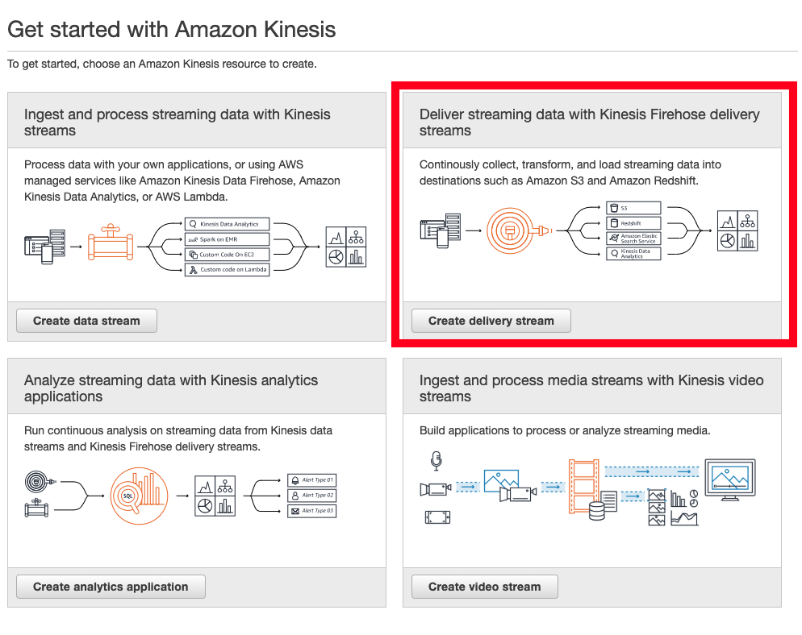

# Part 1: Ingest and Storage

## 1. Create an S3 Bucket

In this step, we will navigate to S3 Console and create the S3 bucket used throughout this demo.

First, navigate to S3 Console & create a new bucket in us-east-1 region :

* Open the s3 console : https://s3.console.aws.amazon.com/s3/home?region=us-east-1
* Click on **:heavy_plus_sign: Create bucket**
    * Bucket Name : **YOUR_USERNAME-datalake-demo-bucket**
    * Region : **US EAST (N. Virginia)**
    * and proceed to create the bucket: **Create** (bottom left)

We now have an S3 bucket named `YOUR_USERNAME-datalake-demo-bucket`. 

You have now set up an S3 bucket! What can you put into an S3 bucket?

In it, we will create a subfolder for storing data. 
We will use this folder structure for this lab series.

```
*--YOUR_USERNAME-datalake-demo-bucket
         │
         ├── data/
         │     └── (raw_data)
         │     └── (reference_data)
         │     └── (training_data)
         │
         └── (..other project assets: code etc.)
         
```

To create a subfolder, 

1. Click on the bucket name: **YOUR_USERNAME-datalake-demo-bucket"
2. You are now looking at the contents of your bucket. It is currently empty.
3. Click on **:heavy_plus_sign: Create folder**
4. Enter the value `data` into the text field. Click on **Save**

You now have the above bucket structure.

## 2. Create a Kinesis Firehose delivery stream

In this step we will start streaming data into the S3, using *Kinesis Firehose (FH)*.

** First, create a FH Delivery Stream. **

* Open the Kinesis Console: https://console.aws.amazon.com/kinesis/home?region=us-east-1#/get-started

* Amazon Kinesis consists of several services: Kinesis Data Streams, Kinesis Firehose, Kinesis Data Analytics and Kinesis Video Streams.



* To create a FH delivery stream, Click on **Create delivery stream**
    * Step 1: Name and source
        * Delivery stream name : **aws-labseries-demo-stream**
        * Source : **Direct PUT or other sources**
        * Click **Next**
        
    * Step 2: Process records
        * Record transformation : Disabled
        * Record format conversion: Disabled
        * Click **Next**
        
    * Step 3: Choose destination
        * Destination : **Amazon S3**
        * S3 bucket : **YOUR_USERNAME-datalake-demo-bucket**. You can select it from the dropdown. 
        * Prefix : `data/raw/`  
            * the backslash `/` after `raw/` is *important*. Without it, your data will land in a outside of the intended folder.
        * Error prefix : `error/`
        * Click **Next**
        
    * Step 4: Configure settings
        * S3 buffer conditions: Buffer size: **1** (MB)
        * S3 buffer conditions:  Buffer interval: **60** (sec)
        * S3 compression : **Disabled**
        * S3 encryption : **Enabled**
        * KMS master key: (Default)aws/s3
        * Error logging : **Enabled**
        * Tags (optional): Leave empty
        * IAM role : Click on **Create new or Choose**
            * This opens a new Tab to create an IAM Role. An IAM Role is the permission set used by Firehose to managed data.
            * IAM Role: **Create a new IAM Role**
            * Role Name: `firehose_delivery_role` (Leave as is)
            * Click on **Allow**.
        * You should be back in the Firehose tab. Click on **Next** to Review your setup.
        
    * Step 5: Review
        * Review the configuration as you have set it up. 
        * To proceed with creating, click on **Create delivery stream**

You have now created a Firehose delivery stream that writes to an S3 bucket *YOUR_USERNAME-datalake-demo-bucket*
Now, it is time to start streaming data into your s3 bucket.


---

## 3(A). Generate Dummy Data

In this step we will configure an application, Kinesis Data Generator to generate random data/event streams into our data lake.

* **Configure Amazon Cognito** for Kinesis Data Generator - In this step we will launch a cloud formation stack that will configure Cognito. This cloudformation scripts launches in **Oregon region** (No need to change this region)
    * Goto : https://console.aws.amazon.com/cloudformation/home?region=us-west-2#/stacks/new?stackName=Kinesis-Data-Generator-Cognito-User&templateURL=https://s3-us-west-2.amazonaws.com/kinesis-helpers/cognito-setup.json
    * Click - **Next**
    * **Specify stack details**. In this step you will create a mock admin for your data generator. Use a simple admin/password combination and keep it handy.
        * Stack name: (autofilled) **Kinesis-Data-Generator-Cognito-User**
        * Username: **admin**
        * Password: **choose a alphanumeric password**
        * Click on **Next**
    * **Configure stack option**
        * Leave all as-is.
        * Click on **Next**
    * Review your configurations, especially for Username and Password.
        * Scroll down
        * :ballot_box_with_check: Check on  **I acknowledge that AWS CloudFormation might create IAM resources**
        * Click on **Create stack**

CloudFormation is now creating a Cognito User you will use with the Data Generator.

You can view the created resources in the **Resources** tab.

When the Stack info status changes to to **Create_Complete**:


Go to the **Outputs** tab. The Data Generator is deployed on the **KinesisDataGeneratorUrl**.
Click on this to open the Data Generator.

* On Amazon Kinesis Data Generator homepage, **Login** with your username & password.


You can now start generating data/event streams for your Firehose delivery.

    * Region: `us-east-1`
    * Stream/delivery stream : `aws-labseries-demo-stream`
    * Records per second : `2000`
    * Record template: Use the json template below: 

```
{
  "uuid": "{{random.uuid}}",
  "device_ts": "{{date.utc("YYYY-MM-DD HH:mm:ss.SSS")}}",
  "device_id": {{random.number(50)}},
  "device_temp": {{random.weightedArrayElement(
    {"weights":[0.30, 0.30, 0.20, 0.20],"data":[32, 34, 28, 40]}
  )}},
  "track_id": {{random.number(30)}},  
  "activity_type": {{random.weightedArrayElement(
        {
            "weights": [0.1, 0.2, 0.2, 0.3, 0.2],
            "data": ["\"Running\"", "\"Working\"", "\"Walking\"", "\"Traveling\"", "\"Sitting\""]
        }
    )}}
}

```

What does this data/message look like? 
What type of application could this send a data stream similar to  this?

You're done! Click on **Send Data** to start sending data streams for Firehose!

Once the tools send ~ 100,000 messages, you can **Stop sending data to Kinesis**.


## 4(A) Validate that data has arrived in S3

Let's see if Firehose has successfully delivered data to your S3 bucket **YOUR_USERNAME-datalake-demo-bucket**. 

* Open the S3 Console again: https://s3.console.aws.amazon.com/s3/home?region=us-east-1
* Open your bucket **YOUR_USERNAME-datalake-demo-bucket** and the **data** folder.
* You will find a subfolder called **raw**. Click through the date-partitioned folders (2019 > 09 > 27 > 15) until you find a list of files named *aws-labseries-demo-stream-xx-xx-xx*.


## Extra Credit!

1. Create your own custom data template to generate data streams similar to your current project applications. KDG extends from [Faker.js](https://github.com/marak/Faker.js/). You can use this to generate stub names, timestamps, addresses etc.

2. Open and view the contents of the data files. 

   ```
   {  "uuid": "a040cdd7-cc47-435f-9e5e-938da65e59a3",  "device_ts": "2019-09-26 15:49:32.004",  "device_id": 19,  "device_temp": 34,  "track_id": 22,    "activity_type": "Sitting"}
   {  "uuid": "e5d411f7-daf2-4801-8153-ce9ea560d66d",  "device_ts": "2019-09-26 15:49:32.006",  "device_id": 10,  "device_temp": 32,  "track_id": 1,    "activity_type": "Walking"}
   ...
   ```
   
   How can we find all unique activities with `"device_id":  10`?


# You're done!

---


## 3(B). Instructor demo - Send data from a simple Wordpress application. 

In this step we will configure a traffic-generator application, Kinesis Data Generator to produce data streams/events for sending into the Kinesis Firehose stream you created earlier. 

* **Configure Amazon Cognito** for Kinesis Data Generator - In this step we will launch a cloud formation stack that will configure Cognito. This cloudformation scripts launches in **Oregon region** (No need to change this region)
    * Goto : https://console.aws.amazon.com/cloudformation/home?region=us-west-2#/stacks/new?stackName=Kinesis-Data-Generator-Cognito-User&templateURL=https://s3-us-west-2.amazonaws.com/kinesis-helpers/cognito-setup.json
    * Click - **Next**
    * Specify Details:
        * Username - **admin**
        * Password - **choose a alphanumeric password**
        * Click - **Next**
    * Options:
        * Click - **Next**
    * Review:
        * Scroll down
        * I acknowledge that AWS CloudFormation might create IAM resources: **Check**
        * Click - **Create**
    * Refresh your AWS Cloudformation Console
    * Wait till the stack status changes to **Create_Complete**
        * Select the **Kinesis-Data-Generator-Cognito-User **stack
        * GoTo outputs tab : click on the link that says: **KinesisDataGeneratorUrl** - This will open your Kinesis Data Generator tool
* On Amazon Kinesis Data Generator homepage
    * **Login** with your username & password from previous step
    * **Region: us-east-1**
    * **Stream/delivery stream : sg-summit-demo-stream**
    * Records per second : 2000
    * **Record template  : **In the **big text area**, add the following json template.


```

{
  "uuid": "{{random.uuid}}",
  "device_ts": "{{date.utc("YYYY-MM-DD HH:mm:ss.SSS")}}",
  "device_id": {{random.number(50)}},
  "device_temp": {{random.weightedArrayElement(
    {"weights":[0.30, 0.30, 0.20, 0.20],"data":[32, 34, 28, 40]}
  )}},
  "track_id": {{random.number(30)}},  
  "activity_type": {{random.weightedArrayElement(
        {
            "weights": [0.1, 0.2, 0.2, 0.3, 0.2],
            "data": ["\"Running\"", "\"Working\"", "\"Walking\"", "\"Traveling\"", "\"Sitting\""]
        }
    )}}
}

```

You're done! Click on **Send Data** to start sending data streams for Firehose!

Once the tools send ~ 100,000 messages, you can **Stop sending data to Kinesis**.

## 4(B) Validate that data has arrived in S3

After few moments GoTo S3 console:https://s3.console.aws.amazon.com/s3/home?region=us-east-1

* Click - **yourname-datalake-demo-bucket > Data**
* There should be a folder called **raw** created > Open it and keep navigating, you will notice that firehose has dumped the data in S3 using **yyyy/mm/dd/hh** partitioning 


Extra Credits

