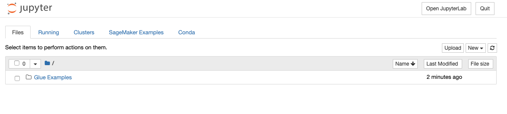

# Part 4 : Transform Data
A Glue Development Endpoint is an environment for you to develop and test your Glue scripts / jobs.
Configuring a Development Endpoint spins up the necessary network and machines to simplify ETL scripting with AWS resources in a VPC. 

In this lab, you will be joining two separate dataframes: one from the `raw` datasets from Firehose against a manually uploaded reference dataset.

The raw dataset contains list of tracks, devices and activities from Firehose. 
The reference dataset contains a list of tracks, track titles and artist names.

You will be using Glue to perform basic transformations such as filtering and joining. 

## 0. Upload and Crawl a Reference Dataset
In this step, you will upload and crawl a new Glue dataset from a manual JSON file.

1. Open your S3 Bucket **YOUR_USERNAME-datalake-demo-bucket*: https://s3.console.aws.amazon.com/s3/home?region=us-east-1#
2. Open the subfolder **data**, and create a subfolder called **reference_data**. Your bucket should look like this: 

    ```
    *--YOUR_USERNAME-datalake-demo-bucket
         │
         ├── data/
         │     └── raw/
         │     └── reference_data/
         │     
         │
         └── (..other project assets: code etc.)
    ```
3. Download the following file [tracks_list.json](https://raw.githubusercontent.com/unnipillai/techfest-building-serverless-datalake-on-aws/master/tracks_list.json), and upload it into the `reference_data/` folder.

4. Open the Glue crawler console. Select the crawler you have created **CrawlDataFromKDG** and **Run crawler**.
	1. The crawlwer picks up new data in the S3 bucket and automatically creates new tables in the database
	2. Notice how this creates two new Glue tables for `raw` and `reference_data`. 
	

## 1. Create Glue Development Endpoint
In this step you will be creating a glue endpoint to interactively develop Glue ETL scripts using PySpark.

* GoTo : https://console.aws.amazon.com/glue/home?region=us-east-1#etl:tab=devEndpoints
* Click - **Add endpoint**
  * Development endpoint name - **DevEndpoint1**
    * IAM role - **AWSGlueServiceRoleLab**
    * Expand - **Security configuration.. parameters**
      * Data processing units (DPUs): **2** (this affects the cost of the running this lab)
      * A single Data Processing Unit (DPU) provides 4 vCPU and 16 GB of memory.
  * Click - **Next**
  * Networking screen :
    * Choose - **Skip networking information**
  * Add an SSH public key (Optional)
    * Leave as defaults
    * Click: **Next**
  * Review the settings
    * Click: **Finish**

It will take close to 10 mins for the Dev Endpoint to be **READY**.
You have to wait for this step to complete before moving to next step.


## 2. Create SageMaker Notebooks (Jupyter) for Glue Dev Endpoints

In this step, we will launch notebook instances to use as our workspace. We will be using Sagemaker notebook instances in this lab. 

* On the navigation on the Left under *Dev endpoints*, click on **Notebooks**.
* Select tab : **Sagemaker notebooks**
* Click: **Create notebook**
  * Notebook name: aws-glue-**notebook1**
  * Attach to development endpoint: **devendpoint1**
  * Choose: **Create an IAM role**
  * IAM Role: *AWSGlueServiceSageMakerNotebookRole*-**default**
  * VPC (optional): Leave blank
  * Encryption key (optional): Leave blank
  * Click: **Create Notebook**

This will take few minutes. Wait for the notebook instance to be *Ready*.
In the meantime, check out the [differences](https://docs.aws.amazon.com/glue/latest/dg/notebooks-with-glue.html) between Sagemaker and Zeppelin instances.

## Upload a Jupyter Notebook on your SageMaker instance

- Download and save this file locally on your laptop: [datalake-notebook.ipynb](https://raw.githubusercontent.com/czhc/serverless-datalake-on-aws/master/lab4/datalake-notebook.ipynb)

- In the Notebooks console, click on the notebook name you have just created: - **aws-glue-notebook1**

- Click on **Open** to launch the web interface for the notebook instance.




- On Sagemaker Jupyter Notebook 
  - Upload the sample `datalake-notebook.ipynb` you downloaded earlier.
  - Click on **datalake-notebook.ipynb** to open the notebook.
  - Make sure it says **'Sparkmagic (PySpark)'** on top right part of the notebook.
    This is the name of the kernel Jupyter will use to execute code blocks in this notebook


**Follow the instructions on the notebook**
	  - Read and understand the instructions, they explain important Glue concepts

## Validate - Transformed / Processed data has arrived in S3

Once the ETL script has ran successfully, you can inspect the output of the SparkSQL transformations.

1. Look into your S3 Bucket: **YOUR_USERNAME-datalake-demo-bucket/data/processed_data**
2. Inspect the new Glue table `processed_data` using Athena


